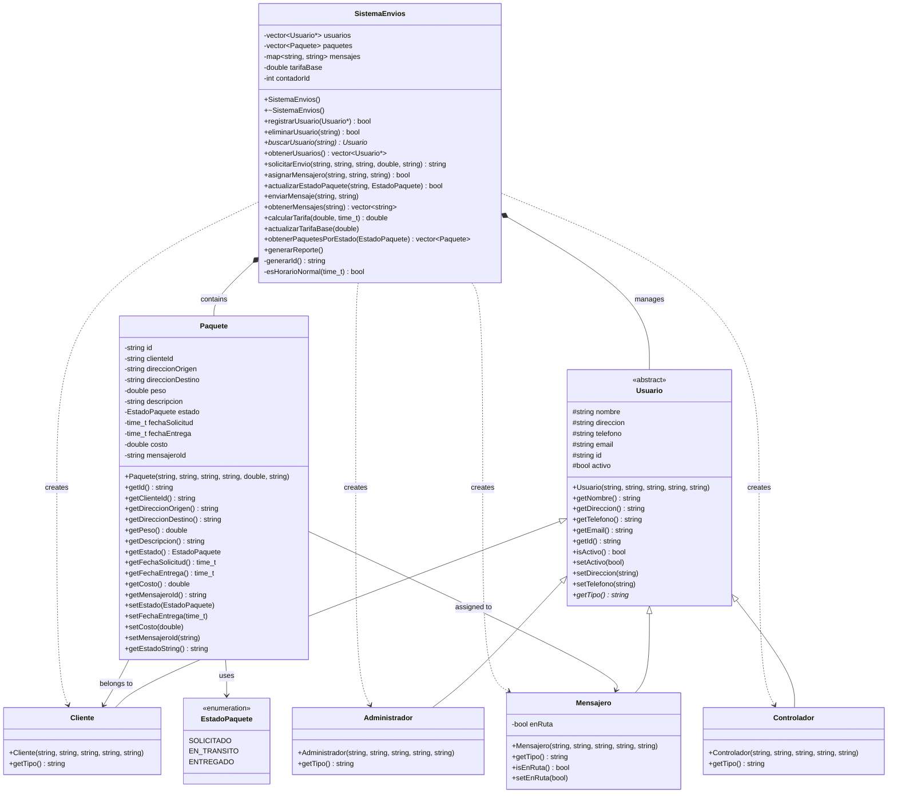
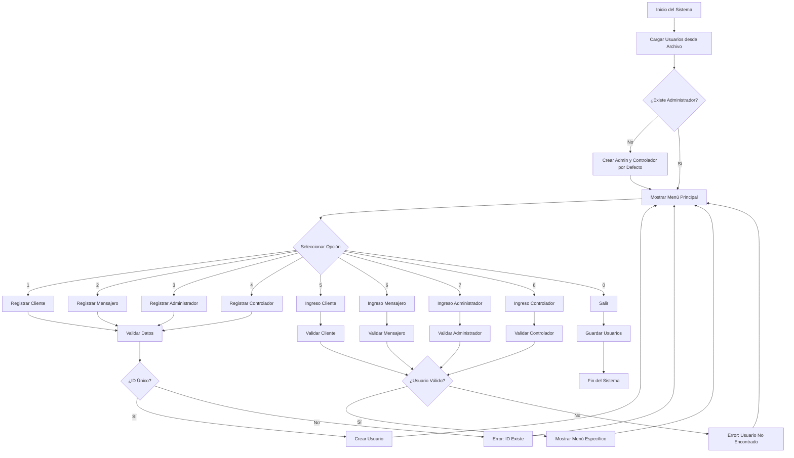
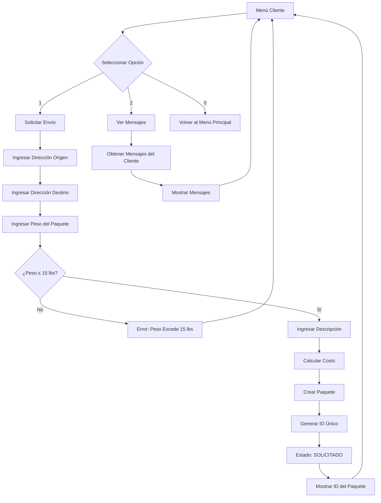
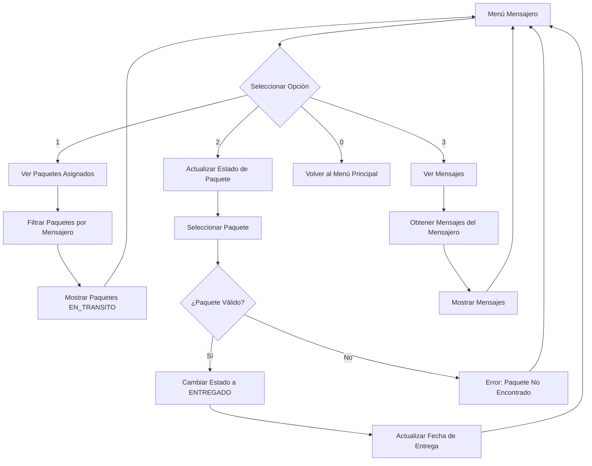
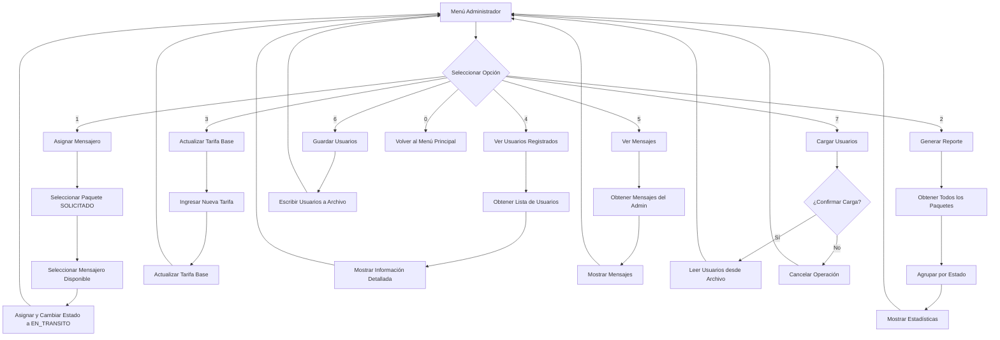
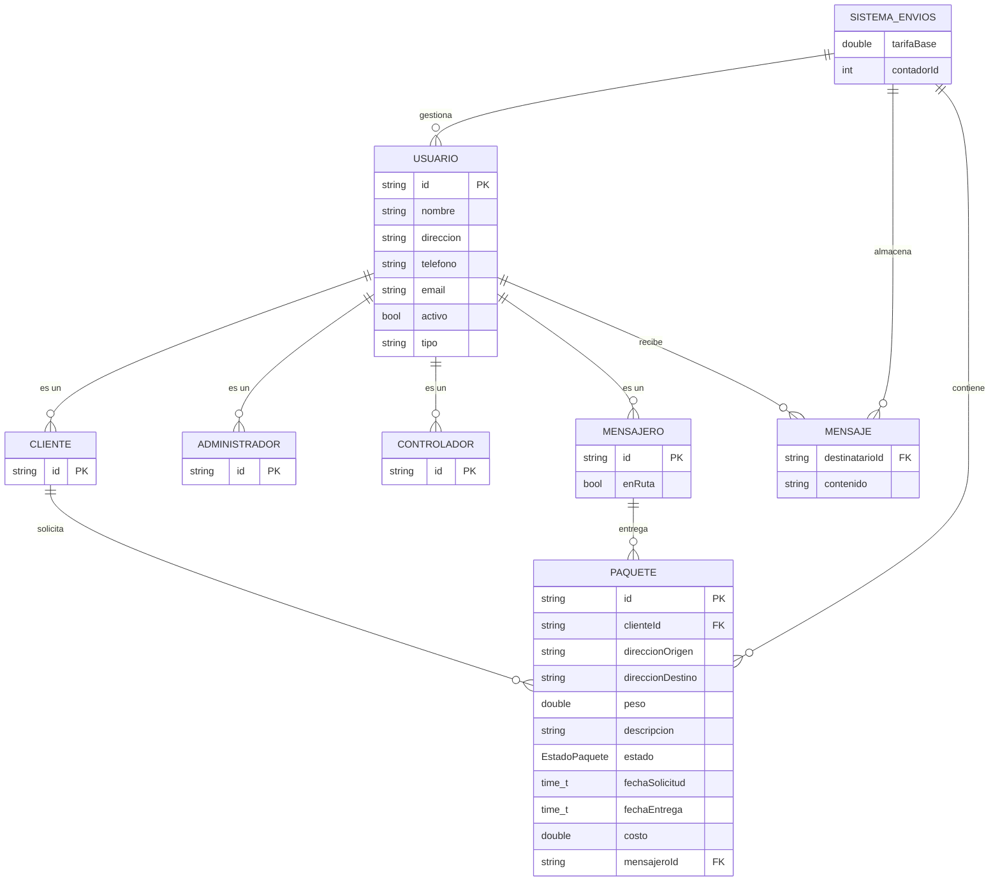
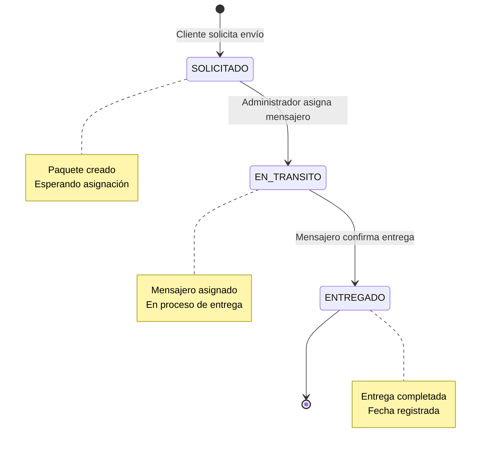
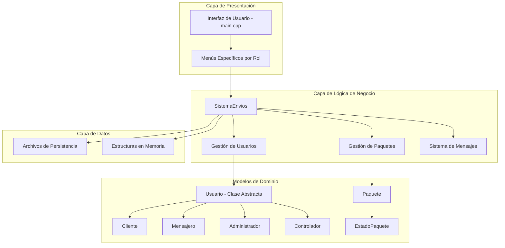

# Sistema de Envíos Garantizados - Documentación Técnica

## Diagrama de Clases UML

## Diagrama de Flujo del Sistema Principal

## Diagrama de Flujo - Menú Cliente

## Diagrama de Flujo - Menú Mensajero

## Diagrama de Flujo - Menú Administrador

## Diagrama Entidad-Relación

## Estados del Paquete

## Arquitectura del Sistema

## Patrones de Diseño Implementados

### 1. **Patrón Template Method**
- La clase `Usuario` define la estructura común
- Las clases derivadas implementan `getTipo()`

### 2. **Patrón Singleton (Implícito)**
- `SistemaEnvios` actúa como punto central de gestión
- Una sola instancia maneja todos los datos

### 3. **Patrón Factory (Implícito)**
- El sistema crea diferentes tipos de usuarios
- Polimorfismo para manejo uniforme

### 4. **Patrón State**
- `EstadoPaquete` representa los estados del paquete
- Transiciones controladas entre estados

## Funcionalidades Principales

### **Gestión de Usuarios**
- Registro de diferentes tipos de usuarios
- Validación de IDs únicos
- Persistencia en archivos
- Autenticación por ID

### **Gestión de Paquetes**
- Solicitud de envíos por clientes
- Validación de peso máximo (15 libras)
- Cálculo automático de tarifas
- Asignación de mensajeros
- Seguimiento de estados

### **Sistema de Mensajes**
- Comunicación entre usuarios
- Almacenamiento por destinatario
- Consulta de mensajes

### **Reportes y Administración**
- Generación de reportes estadísticos
- Actualización de tarifas
- Gestión de usuarios registrados

## Consideraciones Técnicas

### **Memoria**
- Uso de punteros para polimorfismo
- Gestión manual de memoria (destructores)
- Vectores para colecciones dinámicas

### **Persistencia**
- Archivos de texto para almacenamiento
- Carga automática al inicio
- Guardado automático al salir

### **Validación**
- Verificación de IDs únicos
- Validación de tipos de usuario
- Control de peso máximo de paquetes (15 lbs)
- Control de estados de paquetes

### **Escalabilidad**
- Estructura modular
- Fácil extensión de tipos de usuario
- Separación de responsabilidades
