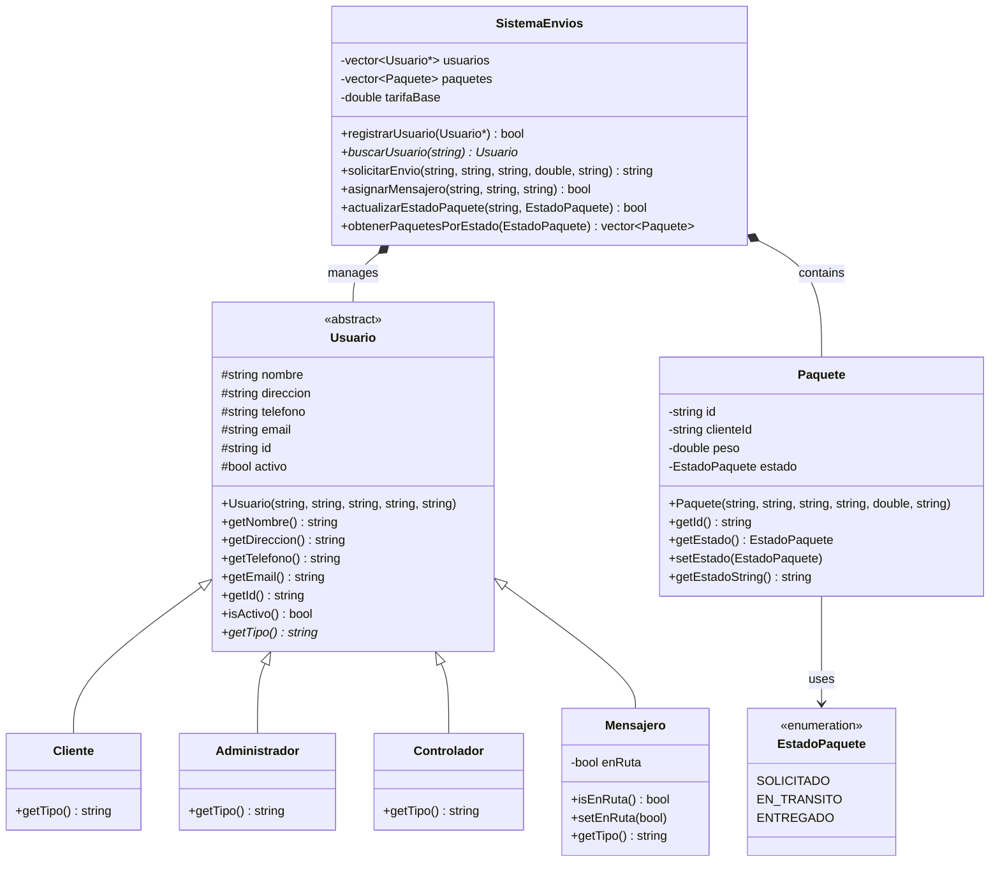
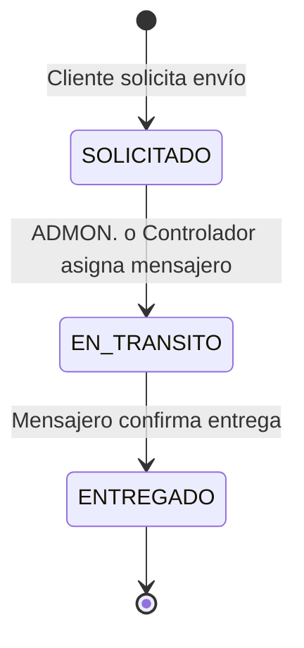

# Sistema de Envíos Garantizados

Este proyecto es un sistema de gestión de envíos basado en la consola, desarrollado en C++. Permite la administración de usuarios con diferentes roles, la solicitud y seguimiento de paquetes, y la persistencia de datos a través de archivos de texto.

## Características Principales

- **Gestión de Usuarios por Roles**: Soporta distintos tipos de usuarios (Cliente, Mensajero, Administrador, Controlador) con menús y permisos específicos para cada uno.
- **Ciclo de Vida de Paquetes**: Los clientes pueden solicitar envíos, los administradores/controladores asignan mensajeros, y los mensajeros actualizan el estado de la entrega.
- **Cálculo de Tarifas**: Calcula el costo del envío basado en una tarifa fija, con recargos por solicitudes fuera de horario.
- **Persistencia de Datos**: Guarda y carga el estado de los usuarios y paquetes en archivos (`usuarios.txt`, `paquetes.txt`), permitiendo que la información no se pierda entre sesiones.
- **Interfaz de Consola Interactiva**: Menús guiados para una fácil interacción del usuario.
- **Validación de Entradas**: Incorpora validaciones para datos como email, teléfono, peso del paquete y números de tarjeta de crédito (Algoritmo de Luhn).

## Arquitectura y Diseño

El sistema está diseñado siguiendo los principios de la Programación Orientada a Objetos y SOLID. La arquitectura separa la lógica de negocio, el modelo de datos y la presentación (interfaz de usuario).

### Diagrama de Clases (UML)



### Flujo de Estados de un Paquete

El estado de un paquete sigue un ciclo de vida claro, gestionado por el sistema.



## Principios de Programación Orientada a Objetos (POO)

- **Abstracción**: La clase `Usuario` es una clase base abstracta que define la interfaz común para todos los tipos de usuarios. El `SistemaEnvios` opera sobre punteros a `Usuario`, desconociendo los detalles concretos de cada rol.
- **Encapsulación**: Los datos de las clases (`Paquete`, `Usuario`, `SistemaEnvios`) están protegidos (privados o protegidos) y solo se puede acceder a ellos a través de métodos públicos (getters y setters), asegurando la integridad de los datos.
- **Herencia**: Las clases `Cliente`, `Mensajero`, `Administrador` y `Controlador` heredan de la clase `Usuario`, reutilizando código y estableciendo una jerarquía de tipos.
- **Polimorfismo**: Se utiliza a través de la función virtual `getTipo()`. Un `vector<Usuario*>` puede almacenar diferentes tipos de usuarios, y el sistema puede invocar `getTipo()` en cada uno para determinar su rol específico en tiempo de ejecución.

## Principios SOLID

- **Principio de Responsabilidad Única (SRP)**: Cada clase tiene un propósito bien definido. `Paquete` modela un paquete, `Usuario` a un usuario, `SistemaEnvios` orquesta la lógica principal y `main.cpp` gestiona la interacción con el usuario.
- **Principio de Abierto/Cerrado (OCP)**: El sistema es extensible. Se puede añadir un nuevo rol (ej. `Supervisor`) creando una nueva clase que herede de `Usuario` sin necesidad de modificar el código existente que maneja usuarios.
- **Principio de Sustitución de Liskov (LSP)**: Las subclases de `Usuario` son completamente sustituibles por su clase base. El sistema lo demuestra al gestionar todos los usuarios a través de un `vector<Usuario*>`.
- **Principio de Segregación de Interfaces (ISP)**: Aunque es más visible en diseños basados en interfaces, el concepto se aplica en la separación de menús. Cada rol tiene su propio menú y solo ve las opciones que le corresponden, evitando que un `Cliente` acceda a funciones de `Administrador`.
- **Principio de Inversión de Dependencias (DIP)**: Los módulos de alto nivel como `SistemaEnvios` dependen de abstracciones (`Usuario`) en lugar de implementaciones concretas (`Cliente`, `Mensajero`), lo que desacopla el sistema.

## Estructura del Proyecto

```
ProjectC++/
├── main.cpp              # Punto de entrada y gestión de menús de la consola.
├── SistemaEnvios.h       # Definición de la clase principal del sistema.
├── SistemaEnvios.cpp     # Implementación de la lógica de negocio.
├── Usuario.h             # Definición de la clase base Usuario y sus derivadas.
├── Usuario.cpp           # Implementación de las clases de usuario.
├── Paquete.h             # Definición de la clase Paquete y el enum EstadoPaquete.
├── Paquete.cpp           # Implementación de la clase Paquete.
├── usuarios.txt          # Archivo de texto para persistencia de usuarios.
├── paquetes.txt          # Archivo de texto para persistencia de paquetes.
└── SYSTEM_DOCUMENTATION.md # Documentación técnica original con diagramas.
```

## Dependencias y Compilación

### Dependencias

El proyecto está construido utilizando C++ estándar y no requiere bibliotecas externas. Solo utiliza las bibliotecas del Standard Template Library (STL) incluidas con cualquier compilador de C++ moderno:
- `<iostream>`
- `<string>`
- `<vector>`
- `<map>`
- `<fstream>`
- `<ctime>`
- `<algorithm>`
- `<iomanip>`
- `<limits>`
- `<cctype>`

### Compilación

Para compilar el proyecto, puedes usar un compilador como g++. Asegúrate de compilar todos los archivos `.cpp` juntos.

```bash
# Comando para compilar con g++
g++ -o main.exe *.cpp

# Después de compilar, ejecuta el programa
.\main.exe
```

## Cómo Usar el Sistema

1.  **Compila y ejecuta** el programa como se indicó anteriormente.
2.  Al iniciar, el sistema cargará los usuarios y paquetes desde `usuarios.txt` y `paquetes.txt`. Si no existen, se creará un Administrador y un Controlador por defecto.
3.  El **Menú Principal** te permitirá `Iniciar Sesión` o `Crear una cuenta`.
4.  **Crear una cuenta**: Puedes registrarte como Cliente, Mensajero, etc. El sistema te asignará un ID único.
5.  **Iniciar Sesión**: Ingresa tu ID de usuario. Serás dirigido al menú correspondiente a tu rol, con las funcionalidades permitidas.
6.  Al salir del programa (opción 0 en el menú principal), todos los datos de usuarios se guardarán automáticamente en `usuarios.txt`. Los paquetes se guardan después de ciertas acciones clave.
